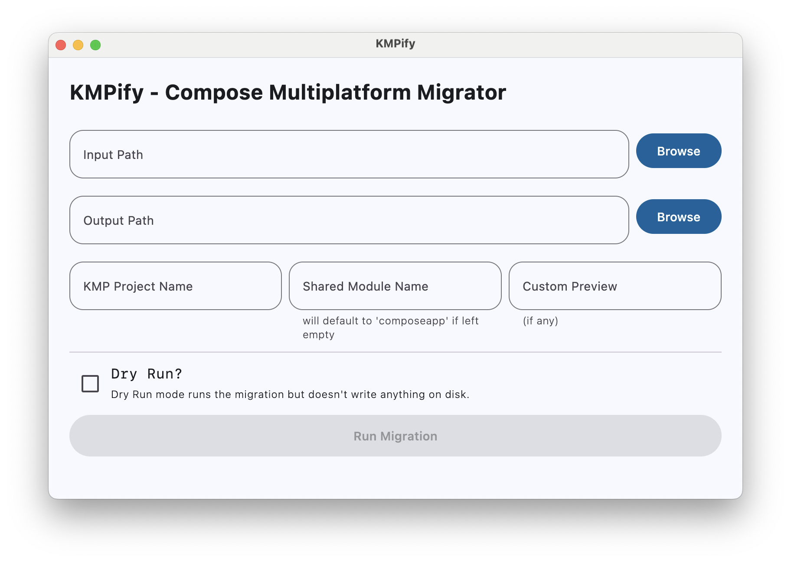
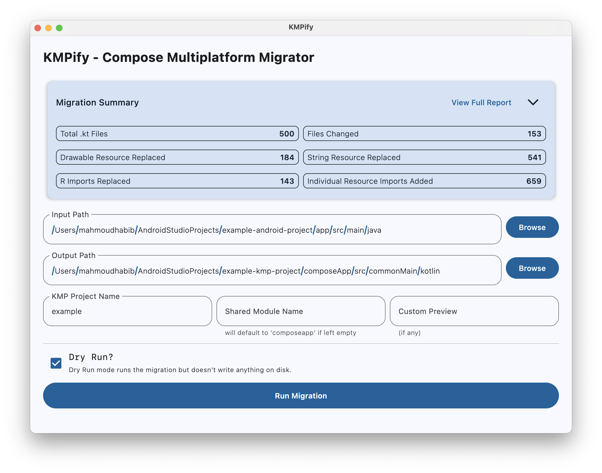
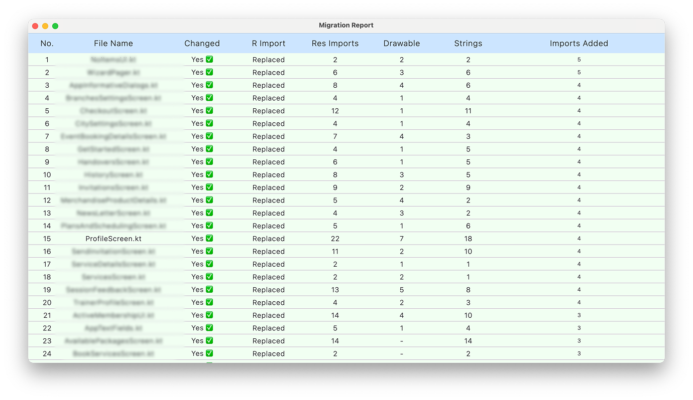
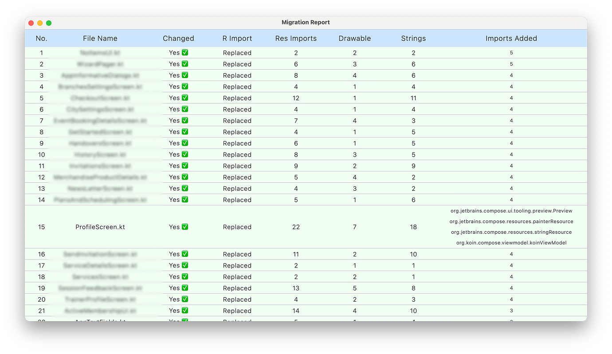

# KMPify

**KMPify** is a Kotlin-based desktop tool designed to help you **migrate Android Jetpack Compose projects** to **Kotlin Multiplatform (KMP)** with minimal effort.

It automatically scans `.kt` files and applies a series of smart transformations to:
- Replace Android-specific resource imports with their KMP-compatible counterparts
- Convert `R.drawable`, `R.string`, and `R.font` references to `Res.drawable`, `Res.string`, etc.
- Rebuild imports cleanly and inject resource references where needed
- Replace annotations like `@DrawableRes` and `@StringRes` with their KMP alternatives
- Replace previews, viewModels, and other common Compose elements

Whether you're migrating an entire module or just experimenting with KMP, **KMPify** speeds up the process and reduces manual editing.

___

## 🧑‍💻 Usage

Once you launch **KMPify**, you’ll be greeted with a simple UI:

### 📝 Input Fields

- **Input Path**: The directory containing your Android Jetpack Compose `.kt` files. Typically your `main/java/` folder.
- **Output Path**: The directory where the migrated files will be saved. Usually points to your KMP `commonMain/kotlin/` directory.
- **KMP Project Name**: The name of your multiplatform project (used to build resource paths).
- **Shared Module Name**: The name of your shared module. Defaults to `composeapp` if left empty.
- **Custom Preview** (Optional): If you're using a custom `@Preview` annotation, you can specify it here.

### ⚙️ Options

- **Dry Run**: When checked, KMPify will simulate the migration and show what would be changed, but it won’t overwrite any files.

### ▶️ To Run the Migration:
1. Fill in the required paths and names.
2. (Optional) Enable Dry Run to preview changes.
3. Click **"Run Migration"**.

---

## 📸 Screenshots

