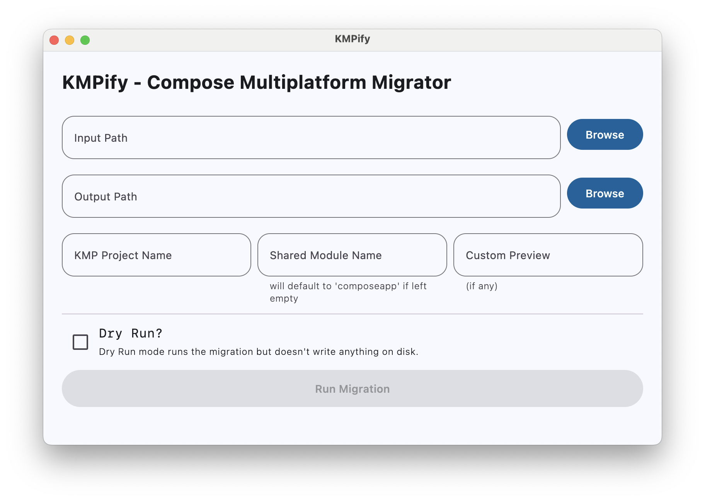
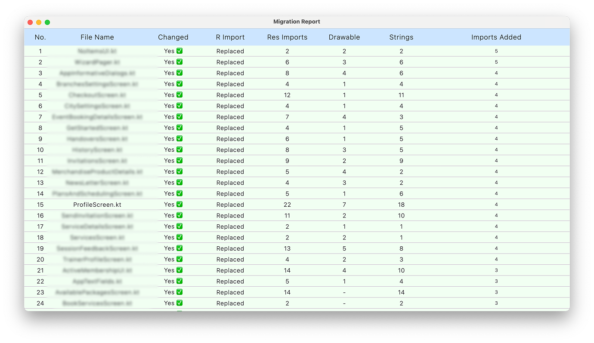
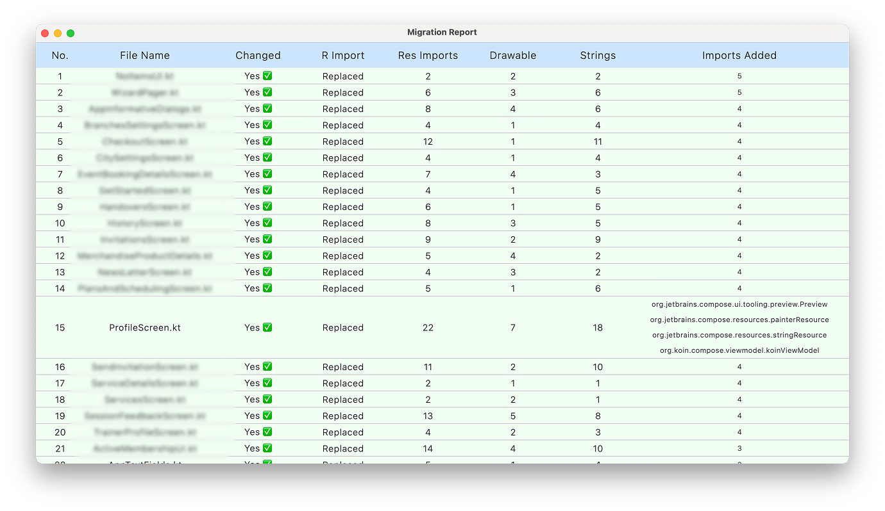

# KMPify

**KMPify** is a Kotlin-based desktop tool designed to help you **migrate Android Jetpack Compose projects** to **Kotlin Multiplatform (KMP)** with minimal effort.

It automatically scans `.kt` files and applies a series of smart transformations to:
- Replace Android-specific resource imports with their KMP-compatible counterparts
- Convert `R.drawable`, `R.string`, and `R.font` references to `Res.drawable`, `Res.string`, etc.
- Rebuild imports cleanly and inject resource references where needed
- Replace annotations like `@DrawableRes` and `@StringRes` with their KMP alternatives
- Replace previews, viewModels, and other common Compose elements

for more about migration steps see [MigrationSteps](docs/MigrationGuide.md)
## Why Use KMPify?

Migrating to Kotlin Multiplatform allows you to share code across multiple platforms, reducing development time and maintenance costs. KMPify simplifies this process by automating repetitive tasks, ensuring your Jetpack Compose project is KMP-ready with minimal effort.

---

## Features

- **Flexible Processing**: Supports single `.kt` files or entire directories with recursive processing.
- **Dry Run Mode**: Preview changes without modifying files.
- **User-Friendly UI**: Simple Compose Desktop interface for inputting paths and configuration.
- **Reports**: Once you run the migration you will get a _MigrationSummary_ and a _MigrationReport_ with all the files and what has changed
___

## Usage

Once you launch **KMPify**, you’ll be greeted with a simple UI:



### Input Fields

- **Input Path**: The directory containing your Android `.kt` files, Typically your `main/java/` folder.
- **Output Path**: The directory where the migrated files will be saved. Usually points to your KMP `commonMain/kotlin/` directory.
- **KMP Project Name**: The name of your multiplatform project (used to build resource paths).
- **Shared Module Name**: The name of your shared module. Defaults to `composeapp` if left empty.
- **Custom Preview** (Optional): If you're using a custom `@Preview` annotation, you can specify it here.

- **Dry Run**: When checked, KMPify will simulate the migration and show what would be changed, but it won’t overwrite any files.

---

### Example
**Input File** (`MainScreen.kt`):
```kotlin
import com.example.android.R
import androidx.compose.ui.res.painterResource
import androidx.compose.ui.res.stringResource

@Composable
fun MainScreen() {
    Image(painter = painterResource(id = R.drawable.icon), contentDescription = null)
    Text(stringResource(id = R.string.app_name))
}
```

**Output File**:
```kotlin
import my_kmp_project.composeapp.generated.resources.Res
import my_kmp_project.composeapp.generated.resources.icon
import my_kmp_project.composeapp.generated.resources.app_name
import org.jetbrains.compose.resources.painterResource
import org.jetbrains.compose.resources.stringResource

@Composable
fun MainScreen() {
    Image(painter = painterResource(resource = Res.drawable.icon), contentDescription = null)
    Text(stringResource(resource = Res.string.app_name))
}
```

---
## 📸 Screenshots




---

## Roadmap

- [x] Support for custom `@Preview` annotations.
- [ ] Command-line interface as an alternative to the GUI.
- [ ] Hilt to Koin migration option

---

## Contributing

We welcome contributions to make KMPify better!
- Report bugs or request features at [GitHub Issues](https://github.com/MahmoudRH/kmpify/issues).
- Open a PR with a clear description of changes and reference any related issues.

---

## Contact

- **Email**: Reach out to [mhmoudrhabib@gmail.com](mailto:mhmoudrhabib@gmail.com) (replace with your actual email).
- **Follow**: Stay updated on [LinkedIn](https://www.linkedin.com/in/mahmoudhabib/).

Star ⭐ this repository to support the project!

---
## License

KMPify is licensed under the Apache License 2.0. See the [LICENSE](https://github.com/MahmoudRH/KMPify?tab=Apache-2.0-1-ov-file) file for details.

